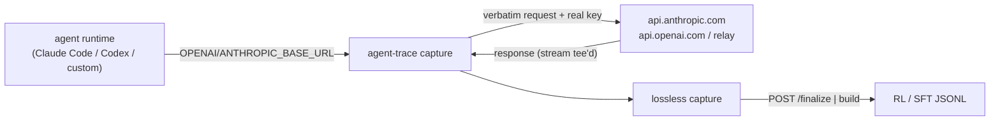

# agent-trace

A **runtime-agnostic capture proxy** that records the *complete* LLM trace of any
agent — Claude Code, Codex, a custom ReAct loop — and serializes it into
**SFT / RL-trainable** records. Installable via npm.

`agent-trace` isolates the **proxy + trajectory-build** layer — the part that
matters for training data: *sit between the agent and the model, capture every
call on the wire, then stitch the turns back into a trainable trace* — without
the rollout orchestration, scheduling, and trainer bridges.

The agent points its base URL at the proxy. Every request is **forwarded
verbatim** to the API it already uses and captured losslessly as it crosses the
wire — not reconstructed from lossy local logs. The agent never knows.

## Two modes

| Mode | Command | Upstream | Captures | Use it for |
| --- | --- | --- | --- | --- |
| **capture** (passthrough) | `agent-trace capture` | the real API the agent uses (Anthropic / OpenAI, public or a relay) | full message-level trace: prompts, tool calls, tool results, reasoning | **any runtime, no backend** — SFT data + reward-attachable RL trajectories |
| **serve** (inference) | `agent-trace serve` | a model **you** host (vLLM / SGLang) | the above **plus** `token_ids` + per-token logprobs | token-level on-policy RL |

> Frontier APIs don't return token ids / logprobs, so `capture` traces are
> message-level. That's fully usable **SFT** data and an RL **trajectory** shape
> with empty reward slots. Token-level RL (exact rollout token ids + logprobs)
> requires `serve` in front of a model you run.



## Install

```bash
npm install -g agent-trace   # CLI
# or as a library:  npm install agent-trace
```

### Auto-capture (install once, then just use `claude`)

```bash
agent-trace install          # adds a transparent `claude` wrapper to your shell rc
source ~/.bashrc            # (or open a new shell)
```

After this, running `claude` interactively — or any launcher that calls it, like
a `cc-dp` function — automatically routes through the capture proxy and saves
trajectories to **`~/.agent-trace/captures`** (default). Nothing else to type, and
your canonical `ANTHROPIC_BASE_URL` is **never modified** (the wrapper only
rewires the child process via `exec`; your real backend is forwarded to).

```bash
agent-trace install --save-dir ~/my-traces   # custom default dir
agent-trace install --print                  # preview the rc block without writing
agent-trace install --command codex          # wrap a different env-based command
agent-trace uninstall                        # remove the wrapper
```

Build trainable samples from the default dir whenever you like:

```bash
agent-trace build ~/.agent-trace/captures --format sft --out sft.jsonl
agent-trace build ~/.agent-trace/captures --format rl  --out rl.jsonl
```

> Each interactive session gets its own ephemeral proxy + a unique session id, so
> concurrent `claude` windows never collide and group cleanly at build time.

## Quick start — `exec` (recommended, non-destructive)

The cleanest way to trace a runtime is `agent-trace exec`: it starts the capture
proxy, runs your agent command with **only the child process's**
`ANTHROPIC_BASE_URL` / `OPENAI_BASE_URL` pointed at the proxy, and forwards to
your **real** backend (read from your existing `*_BASE_URL`). Your shell's
canonical vars keep their meaning — nothing to set up, nothing to undo.

```bash
# Claude Code (whatever ANTHROPIC_BASE_URL/KEY you already use is preserved):
agent-trace exec --save-dir ./captures -- claude

# any OpenAI-SDK harness:
agent-trace exec --save-dir ./captures -- python my_agent.py

# wrap an existing launcher (e.g. a `cc-dp` function that exports the real
# ANTHROPIC_BASE_URL + key and runs claude) — exec reads those, the child talks
# to the proxy, the proxy forwards to your real backend:
agent-trace exec --save-dir ./captures -- cc-dp
```

`exec` prints the routing it applied, e.g.:

```
ANTHROPIC_BASE_URL -> http://127.0.0.1:8787       (proxy -> https://api.gpugeek.com)
OPENAI_BASE_URL    -> http://127.0.0.1:8787/v1    (proxy -> public default)
```

To route through an **already-running** proxy instead of spawning one, set the
dedicated opt-in var (the canonical `*_BASE_URL` is still left untouched):

```bash
export ANTHROPIC_BASE_URL_TRACE_PROXY=http://127.0.0.1:8787
export OPENAI_BASE_URL_TRACE_PROXY=http://127.0.0.1:8787/v1
agent-trace exec -- claude
```

## Quick start — `capture` (standalone proxy)

Prefer wiring base URLs yourself? Run the proxy standalone. By default it
forwards to the public Anthropic/OpenAI endpoints, **or to your real
`ANTHROPIC_BASE_URL` / `OPENAI_BASE_URL` if set**; override per family as needed.

```bash
npx agent-trace capture --port 8787 --save-dir ./captures

# point at a relay / custom gateway instead:
npx agent-trace capture --port 8787 --save-dir ./captures \
  --anthropic-base-url https://your-relay.example.com \
  --openai-base-url   https://your-relay.example.com
# or one upstream for everything:
#   --upstream-base-url https://your-relay.example.com
```

Then point your agent at it — **keep using your real API key**; it's forwarded
upstream untouched.

**Claude Code** (manual; prefer `exec` above to avoid clobbering your real var):

```bash
ANTHROPIC_BASE_URL=http://127.0.0.1:8787 \
ANTHROPIC_API_KEY=sk-ant-... \
claude                                        # key forwarded upstream untouched
```

**Codex** (`~/.codex/config.toml` — use the Chat wire protocol):

```toml
model = "gpt-5"
model_provider = "agent-trace"

[model_providers.agent-trace]
name = "agent-trace"
base_url = "http://127.0.0.1:8787/v1"
wire_api = "chat"
env_key = "OPENAI_API_KEY"                  # your real key, forwarded upstream
```

> ⚠️ **Cursor**: its Agent/Composer/Tab all run on Cursor's own servers, so a
> local proxy can't see those calls. Only *Ask/Plan* (Cmd/Ctrl+L) honors
> *Override OpenAI Base URL* and can be captured — the agentic trajectory can't.
> For full coding traces use Claude Code / Codex, not Cursor.

Run the agent, then build the trajectory and get samples:

```bash
# in-memory finalize (default session id is "capture"; override with --session-id)
curl -X POST "http://127.0.0.1:8787/sessions/capture/finalize?format=sft" | jq

# or, if you ran with --save-dir, reconstruct offline from the persisted records:
npx agent-trace build ./captures --format sft --out sft.jsonl
npx agent-trace build ./captures --format rl  --out rl.jsonl
```

### Grouping into sessions

All calls in one `capture` run land in a single session (id from `--session-id`,
default `capture`). To split concurrently, have the harness send an
`x-session-id` header or a `?session_id=` query param; the proxy groups by that
and never treats your API key as a session id.

## Quick start — serve (token-level RL)

For on-policy RL you need a model you host that emits token ids + logprobs (vLLM
with `return_token_ids`, or patched SGLang). The proxy normalizes the agent's
request to OpenAI chat, injects the training-signal params, and captures the
exact sampled token ids.

```bash
npx agent-trace serve \
  --inference-base-url http://localhost:8000 \
  --model Qwen/Qwen3-8B --engine vllm \
  --port 8080 --save-dir ./captures
```

Point the agent at it with the **session id as the API key**, then finalize to
the token-level RL format:

```bash
export OPENAI_BASE_URL=http://localhost:8080/v1
export OPENAI_API_KEY=my-rollout-001        # == session id
# ... run agent ...
curl -X POST "http://localhost:8080/sessions/my-rollout-001/finalize?builder=prefix_merging&format=rl"
```

## Quick start — library

```ts
import {
  PrefixMergingBuilder,
  parseCompletionSession,
  trajectoryToRLSamples,
  trajectoryToSFTSamples,
} from "agent-trace";

const session = parseCompletionSession({
  session_id: "rollout-1",
  completions: [/* captured CompletionRecord[] */],
});
const trajectory = await new PrefixMergingBuilder().build(session);

const rl = trajectoryToRLSamples(trajectory);                 // token-level, GRPO-ready
const sft = trajectoryToSFTSamples(trajectory, { includeTokens: true });
```

Embed either proxy mode in your own service:

```ts
import { CaptureProxy } from "agent-trace/proxy";

// capture mode — no backend
const capture = new CaptureProxy({
  mode: "passthrough",
  upstreams: { default: "https://your-relay.example.com" }, // omit for public APIs
  saveDir: "./captures",
});
await capture.listen(8787);

// inference mode — token-level RL
const serve = new CaptureProxy({
  inferenceBaseUrl: "http://localhost:8000",
  modelServed: "Qwen/Qwen3-8B",
  engine: "vllm",
});
await serve.listen(8080);
```

## Builders

- **`per_request`** — one trace per captured completion. Simplest; every request
  preserved independently.
- **`prefix_merging`** — stitches an agent's append-only multi-turn chain into a
  single trace (`prompt + response_1 + interstitial + response_2 + ...`). In
  `serve` mode, assistant bodies use the raw sampled token ids (real logprobs,
  no re-encode) and interstitials (tool results, chat-template glue) are masked
  out (`loss_mask = 0`). The turn boundary is the end-of-turn token
  (auto-detected, or set `--end-of-turn-token-id`).

## Output formats

RL sample (one per trace):

```jsonc
{
  "token_ids": [/* prompt_ids + response_ids (serve mode) */],
  "prompt_len": 12,
  "response_len": 40,
  "loss_mask": [/* 0/1 over the response */],
  "logprobs": [/* rollout logprobs over the response */],
  "reward": null,
  "finish_reason": "stop",
  "metadata": {}
}
```

SFT sample (one per trace):

```jsonc
{
  "messages": [/* prompt_messages + response_messages, OpenAI chat shape */],
  "tools": [/* ... */],
  "input_ids": [/* with --include-tokens (serve mode) */],
  "labels": [/* -100 on prompt and loss_mask=0 positions */]
}
```

## HTTP API

- `POST /v1/chat/completions`, `POST /v1/messages` — proxied + captured.
- `GET  /v1/models`, `GET /health` — status.
- `GET  /sessions/:id/completions` — captured records (normalized OpenAI chat;
  in capture mode the raw native response is preserved under `metadata.raw_response`).
- `POST /sessions/:id/finalize?builder=&format=rl|sft|trajectory&include_tokens=&end_of_turn_token_id=&save=`
  — build the trajectory and return (and optionally write) samples.
- `POST /admin/inference/pause` · `POST /admin/inference/resume` — *(serve mode)*
  gate outbound generation around weight syncs for async RL.
- `DELETE /sessions/:id` — drop a session.

## Supported APIs

Inbound API the agent speaks (and is forwarded verbatim in capture mode):

| Inbound API | capture (passthrough) | serve (inference) |
| --- | --- | --- |
| OpenAI Chat Completions (`/v1/chat/completions`) | supported | supported |
| Anthropic Messages (`/v1/messages`) | supported | supported |
| OpenAI Responses (`/v1/responses`) | not yet — use Codex `wire_api = "chat"` | not yet |
| Google Gemini | not yet | not yet |

## Requirements

- Node.js >= 20 (uses global `fetch`).
- **capture**: nothing else — your existing API key / relay.
- **serve / token-level RL**: an OpenAI-compatible inference server that returns
  token ids + logprobs (e.g. vLLM `return_token_ids`, or SGLang with a logprobs patch).

## License

Apache-2.0.
